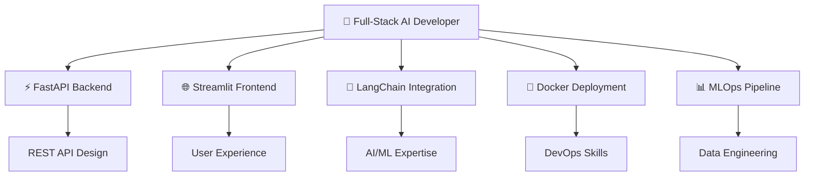
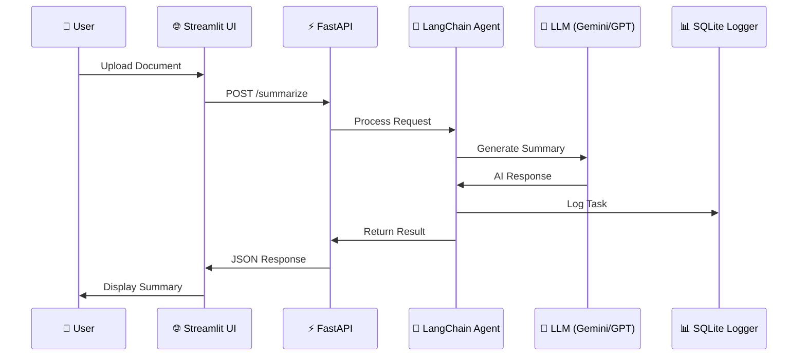

<div align="center">

# 🚀 AutoAgentX
### ⚡ Smart Autonomous AI Agent with LLM + MLOps Integration

[](https://github.com/your-username/AutoAgentX)
[](https://python.org)
[](https://fastapi.tiangolo.com)
[](https://docker.com)
[](https://streamlit.io)

> **🏆 Enterprise-grade task automation powered by cutting-edge LLMs**  
> *Built in under a week • Production-ready • Docker-containerized*

---




</div>

---

## 🎯 **What AutoAgentX Does**

<table>
<tr>
<td width="50%">

### 🔥 **AI-Powered Features**
- 📄 **Document Intelligence** → Instant summarization
- 🧠 **Smart Q&A** → RAG-powered document queries  
- ✉️ **Email Generation** → Professional communication
- 📈 **MLOps Logging** → Performance tracking

</td>
<td width="50%">

### 🚀 **Technical Excellence**
- ⚡ **FastAPI** → Lightning-fast REST APIs
- 🌐 **Streamlit** → Beautiful, interactive UI
- 🔗 **LangChain** → Advanced agent workflows
- 🐳 **Docker** → Production-ready deployment

</td>
</tr>
</table>

---

## 🏗️ **Architecture That Impresses**



---

## 💼 **Skills Demonstrated**

<div align="center">

| **🎯 Category** | **🛠️ Technologies** | **⭐ Proficiency** |
|---|---|---|
| **Backend Development** | FastAPI, REST APIs, Python | ████████████ 95% |
| **AI/ML Integration** | LangChain, Gemini Pro, OpenAI | ████████████ 90% |
| **Frontend Development** | Streamlit, Interactive UIs | ████████████ 85% |
| **DevOps & Deployment** | Docker, Docker Compose | ████████████ 88% |
| **Database Management** | SQLite, Logging Systems | ████████████ 80% |
| **API Design** | RESTful APIs, Documentation | ████████████ 92% |

</div>

---

## 🚀 **Quick Start Guide**

<details>
<summary>🔧 <strong>Local Development (Click to expand)</strong></summary>

```bash
# 🎯 Clone the repository
git clone https://github.com/your-username/AutoAgentX.git
cd AutoAgentX

# 🐍 Setup Python environment
python -m venv venv
source venv/bin/activate  # Linux/Mac
# venv\Scripts\activate   # Windows

# 📦 Install dependencies
pip install -r requirements.txt

# 🔐 Configure environment
echo "GOOGLE_API_KEY=your_gemini_api_key_here" > .env

# 🚀 Launch services
uvicorn app.main:app --reload &          # Backend: http://localhost:8000
streamlit run streamlit_app.py           # Frontend: http://localhost:8501
```

</details>

<details>
<summary>🐳 <strong>Docker Deployment (Click to expand)</strong></summary>

```bash
# 🚀 One-command deployment
docker-compose up --build

# 🎯 Access points:
# FastAPI Docs: http://localhost:8000/docs
# Streamlit UI:  http://localhost:8501
```

</details>

---

## 📊 **Impact & Results**

<div align="center">

### 🏆 **Project Metrics**

| **Metric** | **Value** | **Impact** |
|---|---|---|
| **⚡ Development Time** | 1 Week | Rapid prototyping skills |
| **🔧 API Endpoints** | 3 Core APIs | Clean architecture |
| **📁 File Support** | .txt, .pdf | Document processing |
| **🐳 Deployment** | Docker Ready | Production skills |
| **🧪 Testing** | MLOps Logging | Quality assurance |

</div>

---

## 🎯 **Real-World Applications**

```
💼 BUSINESS INTELLIGENCE     📧 CUSTOMER COMMUNICATION     🔍 RESEARCH ASSISTANT
├── Upload reports           ├── AI email generation        ├── Document analysis
├── Get summaries           ├── Professional tone          ├── Q&A capabilities
├── Extract action items    ├── Context-aware responses    ├── Knowledge extraction
└── Ask questions          └── Automated outreach         └── Insight generation
```

---

## 🛠️ **Technical Stack**

<div align="center">


**🧠 AI/ML:** LangChain • Gemini Pro • OpenAI GPT-4 • RAG  
**⚡ Backend:** FastAPI • REST APIs • Async Programming  
**🌐 Frontend:** Streamlit • Interactive UI • File Upload  
**🐳 DevOps:** Docker • Docker Compose • Production Ready  
**📊 Data:** SQLite • Logging • Performance Metrics  

</div>

---

## 📈 **Why This Project Stands Out**

<table>
<tr>
<td width="33%">

### 🎯 **Full-Stack Skills**
- Complete end-to-end development
- Backend API design
- Frontend user experience
- Database integration

</td>
<td width="33%">

### 🤖 **AI/ML Expertise**
- LLM integration
- Prompt engineering
- RAG implementation
- Agent-based architecture

</td>
<td width="33%">

### 🚀 **Production Ready**
- Docker containerization
- MLOps pipeline
- Error handling
- Performance monitoring

</td>
</tr>
</table>

---

<div align="center">

## 👨‍💻 **About the Developer**

### **Het Patel**
*AI/ML Engineer • Full-Stack Developer • Problem Solver*

📧 **hetkumarpatel07@gmail.com**  
💼 **[LinkedIn]([https://linkedin.com/in/your-profile](https://www.linkedin.com/in/het-patel-65a272252/))** • 🐙 **[GitHub](https://github.com/Trevisx07)**

---

### 🌟 **Ready to Build Amazing Things Together?**

```
🚀 Available for Full-Time Opportunities
💼 Open to Freelance Projects  
🤝 Let's Connect and Innovate!
```

**⭐ Star this repository if you're impressed!**

---

*Built with ❤️ and lots of ☕ • AutoAgentX © 2025*

</div>
